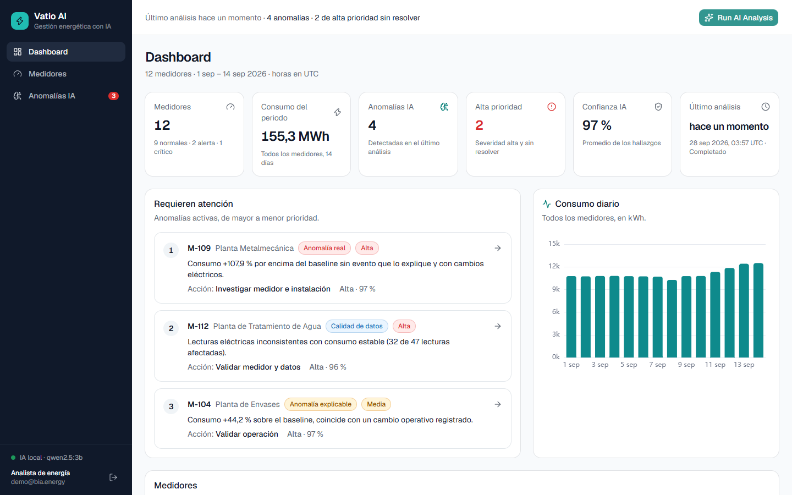
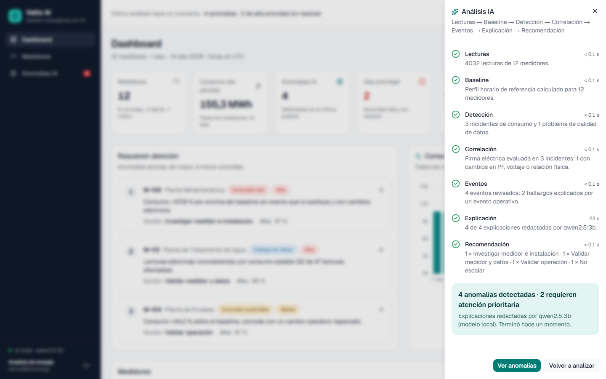
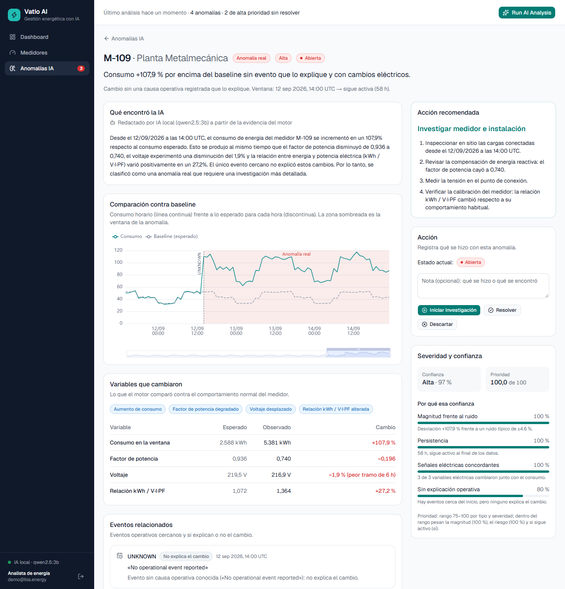

# Vatio AI — AI Energy Management Platform

MVP que convierte las lecturas de 12 medidores eléctricos en decisiones operativas: **detecta**
anomalías, las **explica** con evidencia, las **prioriza** y **recomienda** qué hacer.

**DATOS → ANÁLISIS → ANOMALÍA → EXPLICACIÓN → PRIORIZACIÓN → ACCIÓN**



## Inicio rápido

Requisitos: **Node.js ≥ 22.12** y **pnpm ≥ 10**.

```bash
pnpm install
pnpm dev
```

Abre **http://localhost:5173** y entra con **demo@bia.energy / energia2026** (el login tiene un
botón que completa las credenciales). Pulsa **Run AI Analysis**.

- La API (http://localhost:3000, documentación en **/docs**) crea la base SQLite y carga los datos
  la primera vez que arranca. Para regenerarla: `pnpm db:reset`.
- **LLM local opcional:** si tienes [Ollama](https://ollama.com) con el modelo `qwen2.5:3b`
  (`ollama pull qwen2.5:3b`), la API lo detecta sola y las explicaciones las redacta el modelo.
  Sin Ollama, todo funciona igual con plantillas generadas a partir de la evidencia.

## Qué responde la plataforma

| Pregunta del enunciado                                  | Dónde se responde                                                        |
| ------------------------------------------------------- | ------------------------------------------------------------------------ |
| ¿Qué está pasando con los medidores?                    | Dashboard y Medidores: estado, consumo de 24 h frente al baseline        |
| ¿Qué lecturas se salen de su comportamiento esperado?   | Detalle del medidor: serie horaria, baseline y ventana de la anomalía    |
| ¿La anomalía es real, explicable o de calidad de datos? | Tipo de cada hallazgo, con los eventos que lo explican o no              |
| ¿Cuál debería investigarse primero?                     | Anomalías IA, ordenadas por prioridad (0–100)                            |
| ¿Por qué la IA llegó a esa conclusión?                  | Investigación: explicación, variables, evidencia y factores de confianza |
| ¿Qué acción recomienda?                                 | Investigación: acción y pasos; la Acción queda registrada                |

Resultado sobre el dataset entregado:

| Medidor | Tipo                | Severidad | Confianza | Prioridad | Acción                           |
| ------- | ------------------- | --------- | --------- | --------- | -------------------------------- |
| M-109   | Anomalía real       | Alta      | 97 %      | 100       | Investigar medidor e instalación |
| M-112   | Calidad de datos    | Alta      | 96 %      | 73        | Validar medidor y datos          |
| M-104   | Anomalía explicable | Media     | 97 %      | 29        | Validar operación                |
| M-106   | Falso positivo      | Baja      | 99 %      | 6         | No escalar                       |

Los otros 8 medidores no tienen hallazgos.

## Recorrido

| Run AI Analysis                                          | Investigación de M-109                                                                   |
| -------------------------------------------------------- | ---------------------------------------------------------------------------------------- |
|      |                              |
| Las 7 etapas del análisis, con su resumen y su duración. | Qué encontró la IA, comparación contra baseline, variables, eventos, confianza y acción. |

Más capturas: [login](docs/screenshots/01-login.png) ·
[medidores](docs/screenshots/04-medidores.png) ·
[detalle de M-109](docs/screenshots/05-detalle-m109.png) ·
[anomalías](docs/screenshots/06-anomalias.png).

## Cómo funciona la IA

La IA tiene dos capas, y cada una hace lo que mejor sabe hacer.

**1. Motor analítico** (`packages/engine`): reglas estadísticas explicables, sin ML
([ADR 0005](docs/adr/0005-motor-de-anomalias.md)).

- **Baseline:** mediana por hora del día de cada medidor.
- **Detección:** incidentes de consumo (≥ 3 h a más de ±25 % del baseline) e incidentes de calidad
  de datos (voltaje fuera de banda, saltos bruscos, relación kWh / V·I·PF errática).
- **Correlación:** cambios en factor de potencia, voltaje y relación física durante el incidente.
  Una relación desplazada pero estable indica un cambio eléctrico real (M-109); una errática,
  datos inconsistentes (M-112).
- **Eventos:** solo un cambio operativo (aumento) o una parada programada con recuperación explican
  un cambio. El evento `UNKNOWN` de M-109 no explica nada.
- **Priorización:** rango por tipo y severidad (una anomalía real siempre va antes que un problema
  de calidad de datos) y posición según magnitud, riesgo y vigencia. La confianza sale de factores
  que la interfaz muestra uno por uno.

Todos los umbrales dejan al menos el doble de margen sobre el ruido del peor medidor sano: un test
mueve cada umbral ±20 % y comprueba que el resultado no cambia.

**2. Capa de texto** (`packages/ai`): convierte la evidencia en una explicación y unos pasos
([ADR 0006](docs/adr/0006-capa-de-ia.md)).

- La frase corta y la **acción principal siempre salen de reglas**: el LLM no puede recomendar algo
  incoherente.
- La explicación la redacta un **LLM libre y local** (Ollama + Qwen 2.5 3B, sin API key) a partir
  de los hechos verificados. Antes de aceptarla se valida que **todo número esté en la evidencia**,
  que no afirme causas desconocidas y que no use ids ni nombres internos. Si falla algo, se usa la
  plantilla y la interfaz lo indica.

## Arquitectura

```
data/*.csv ─► apps/api (Fastify + SQLite) ─────────────► apps/web (React)
                │  carga y validación                       Dashboard · Medidores
                │  POST /ai/analyze ─► packages/engine      Anomalías IA · Investigación
                │                       (reglas, sin red)
                │                  ─► packages/ai ─► Ollama (opcional, local)
                └─ contratos zod ◄── packages/shared ──► tipos del frontend
```

| Capa         | Tecnología                                                         |
| ------------ | ------------------------------------------------------------------ |
| Lenguaje     | TypeScript estricto en todo el stack, monorepo con pnpm workspaces |
| API          | Node 22 + Fastify, validación y OpenAPI desde esquemas zod         |
| Persistencia | SQLite + Drizzle ORM, migraciones versionadas                      |
| Frontend     | React + Vite, Tailwind + shadcn/ui, ECharts, TanStack Query        |
| IA           | Motor de reglas propio + LLM local opcional (Ollama, Qwen 2.5 3B)  |
| Calidad      | Vitest, Testing Library, Playwright, ESLint, Prettier              |

```
apps/api         API REST, carga de datos, análisis asíncrono por etapas, sesión
apps/web         Interfaz
packages/engine  Motor analítico puro (baseline, detección, clasificación, prioridad)
packages/ai      Explicaciones: plantillas, proveedor Ollama y controles
packages/shared  Contratos de la API compartidos por backend y frontend
e2e              Tests de punta a punta del flujo de la demo (Playwright)
data             Datasets de entrada
docs/adr         Decisiones de arquitectura
```

## API

Documentación interactiva en **http://localhost:3000/docs**. Todas las rutas van bajo `/api` y,
salvo `health` y `auth/login`, requieren sesión
([ADR 0007](docs/adr/0007-api-y-analisis-asincrono.md)).

| Método | Ruta                           | Qué hace                                                                                |
| ------ | ------------------------------ | --------------------------------------------------------------------------------------- |
| POST   | `/auth/login` · `/auth/logout` | Inicia o cierra la sesión (cookie httpOnly)                                             |
| GET    | `/dashboard/summary`           | KPIs, consumo diario, anomalías que requieren atención, último análisis                 |
| GET    | `/meters`                      | Medidores; `status`, `search`, `sort` (`consumption`, `variation`, `severity`), `order` |
| GET    | `/meters/:meterId`             | Consumo actual, baseline horario, anomalías y eventos                                   |
| GET    | `/meters/:meterId/readings`    | Serie horaria de consumo, voltaje, corriente y PF (`from`, `to`)                        |
| POST   | `/ai/analyze`                  | Run AI Analysis: 202 con el análisis, o 409 con el que ya está en curso                 |
| GET    | `/ai/analysis/:id` · `/latest` | Estado del análisis y de sus 7 etapas                                                   |
| GET    | `/anomalies`                   | Anomalías vigentes por prioridad; `type`, `severity`, `status`, `meterId`               |
| GET    | `/anomalies/:id`               | Investigación: explicación, pasos, evidencia e historial                                |
| PATCH  | `/anomalies/:id`               | Acción: `IN_PROGRESS`, `RESOLVED`, `DISMISSED` u `OPEN`, con nota                       |

## Calidad

```bash
pnpm check      # formato + lint + typecheck + 180 tests unitarios y de integración
pnpm test:e2e   # 4 tests de punta a punta en el navegador (flujo completo de la demo)
```

| Paquete           | Tests | Qué cubren                                                                                |
| ----------------- | ----- | ----------------------------------------------------------------------------------------- |
| `packages/engine` | 66    | Los 4 casos del dataset, 8 sanos sin hallazgos, sensibilidad ±20 %, escenarios sintéticos |
| `packages/ai`     | 41    | Plantillas, validación de números y de contenido, proveedor Ollama                        |
| `apps/api`        | 64    | Login, sesión y límite de intentos, flujo sobre el dataset real, Acción, fallos, LLM      |
| `apps/web`        | 9     | Formato, insignias, login y error al lanzar el análisis                                   |
| `e2e`             | 4     | Login → Dashboard → M-109 → Run AI Analysis → Anomalía → Explicación → Acción             |

Los tests de punta a punta usan en Windows el Edge del sistema; en otros sistemas,
`PW_CHANNEL=chrome` o `pnpm --filter @aiem/e2e exec playwright install chromium`.
`pnpm screenshots` regenera las capturas de este README.

## Datos

- `data/readings.csv`: 4.032 lecturas horarias de 12 medidores (2026-09-01 → 2026-09-14).
- `data/events.csv`: eventos operativos conocidos.
- `data/meters.json`: nombre y ubicación de cada medidor. **Son ficticios**: los CSV no los traen.
- `expected_results.csv` es el ground truth del evaluador: no está en el repo y el motor no lo usa.

La carga valida la estructura, pero **conserva las lecturas físicamente raras** (los 202 V de M-112
son justamente la señal que tiene que encontrar el motor). Todas las horas están en **UTC**
([ADR 0004](docs/adr/0004-ingesta-y-zona-horaria.md)).

## Decisiones

| ADR                                               | Decisión                                               |
| ------------------------------------------------- | ------------------------------------------------------ |
| [0001](docs/adr/0001-typescript-monorepo.md)      | TypeScript en todo el stack, monorepo con pnpm         |
| [0002](docs/adr/0002-fastify.md)                  | Fastify para la API                                    |
| [0003](docs/adr/0003-sqlite-drizzle.md)           | SQLite + Drizzle                                       |
| [0004](docs/adr/0004-ingesta-y-zona-horaria.md)   | Validación estructural en la carga y horas en UTC      |
| [0005](docs/adr/0005-motor-de-anomalias.md)       | Motor de reglas estadísticas y prioridad por rangos    |
| [0006](docs/adr/0006-capa-de-ia.md)               | Plantillas siempre, LLM local opcional con controles   |
| [0007](docs/adr/0007-api-y-analisis-asincrono.md) | Análisis asíncrono por etapas y anomalías persistentes |
| [0008](docs/adr/0008-frontend.md)                 | Frontend con shadcn/ui, ECharts y TanStack Query       |

## Limitaciones conocidas

- El baseline usa todo el periodo; en producción usaría una ventana móvil que excluya los
  incidentes abiertos.
- El análisis corre en el proceso de la API: con más carga iría a una cola de trabajos.
- La confianza es un puntaje explicable, no una probabilidad calibrada.
- Los umbrales salen de un solo dataset; con más medidores habría que recalibrarlos.
- Interfaz pensada para escritorio y solo en tema claro.
